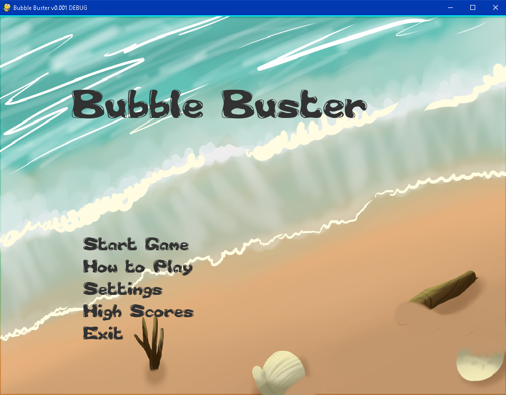

# ChainReaction

a 2d bubble busting game with pygame

pop bubbles to gain points within the time limit

get multipliers for bubbles colliding with other bubbles when they explode.

some bubbles have special abilities that may increase or decrease your chances 

the levels get harder as you progress. watch the timer!

